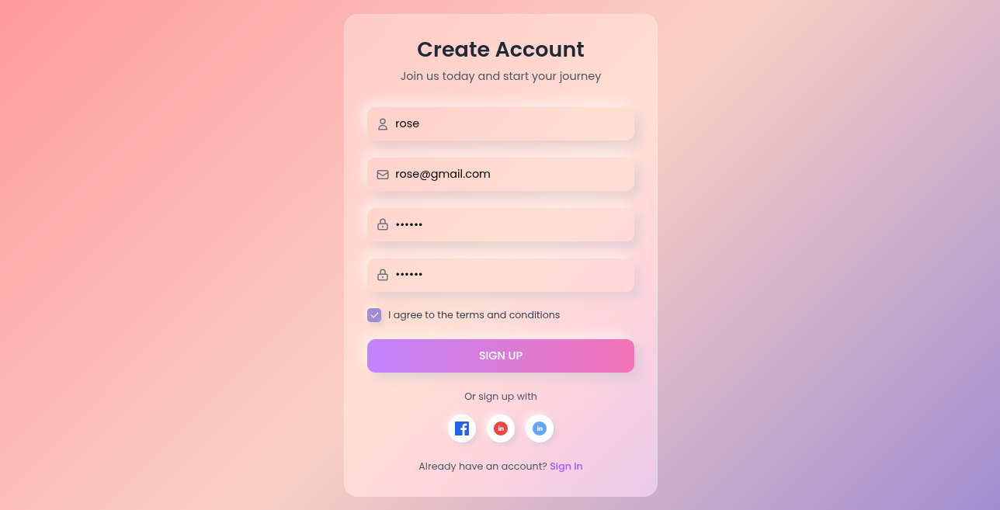
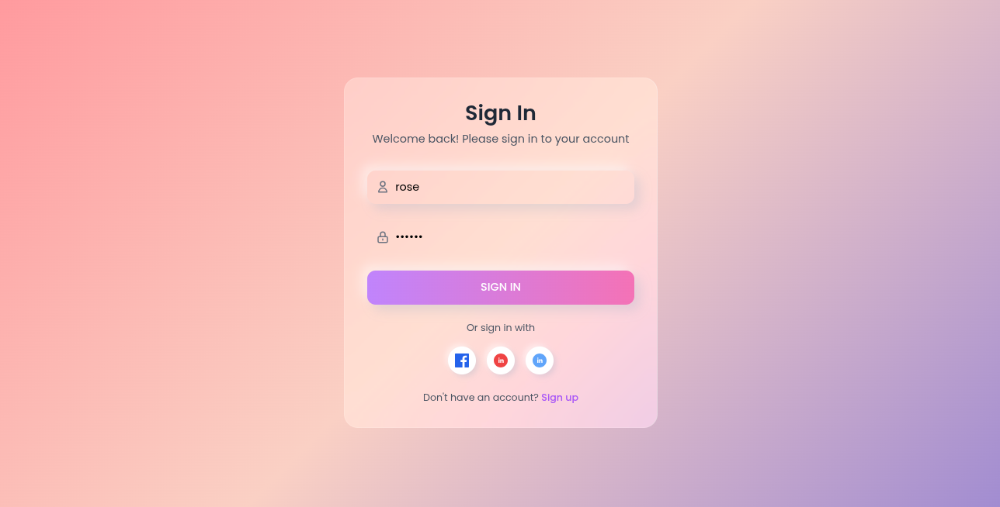
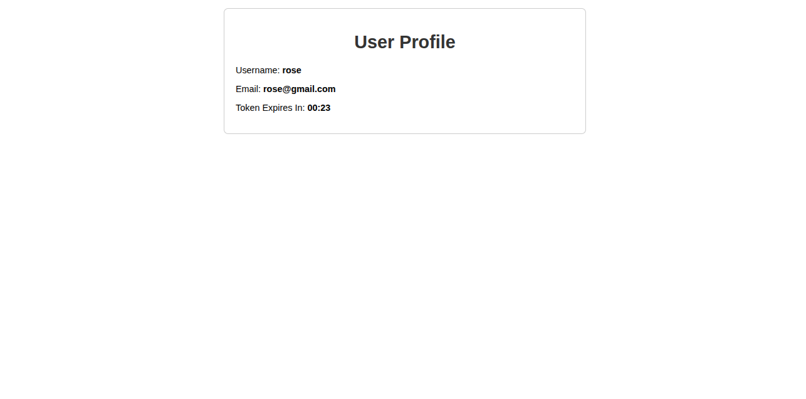
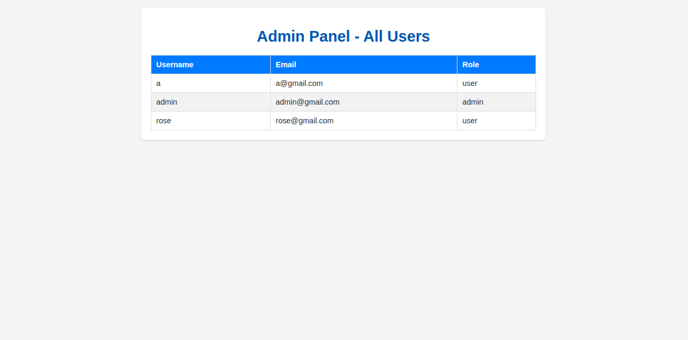
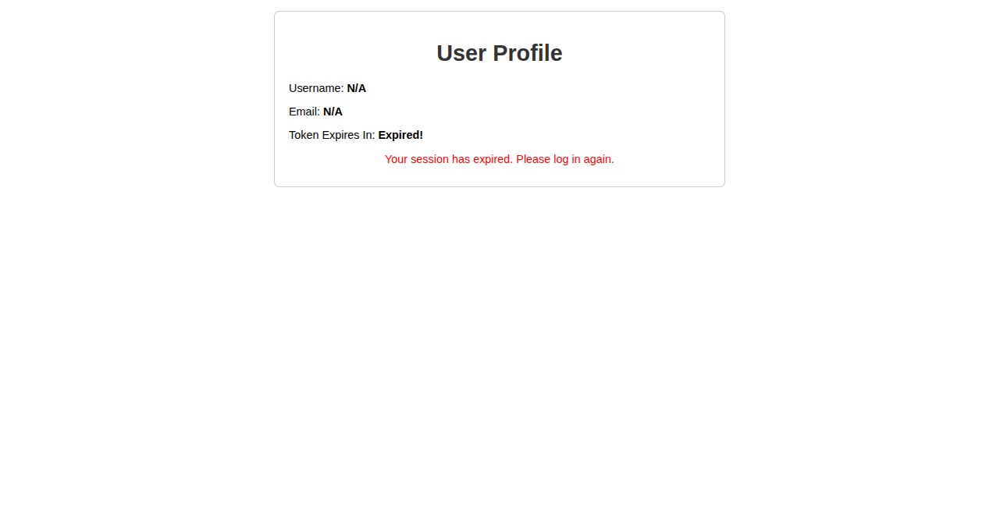

# ซอร์สโค้ดนี้ ใช้สำหรับเป็นตัวอย่างเท่านั้น ถ้านำไปใช้งานจริง ผู้ใช้ต้องจัดการเรื่องความปลอดภัย และ ประสิทธิภาพด้วยตัวเอง

# JWT Authentication Demo with Node.js, Express, and MongoDB

This project is a full-stack application demonstrating user authentication and authorization using JSON Web Tokens (JWT). It features a Node.js and Express.js backend with a MongoDB database, and a frontend built with HTML, Tailwind CSS, and vanilla JavaScript.

## Features

-   **User Registration:** New users can sign up for an account.
-   **User Login:** Registered users can sign in to get a JWT.
-   **JWT Authentication:** Protected routes are secured using JWTs.
-   **Role-Based Authorization:** The application distinguishes between regular users and administrators, with specific routes accessible only to admins.
-   **Protected User Profile:** A dedicated page for users to view their profile information, accessible only with a valid token.
-   **Admin Panel:** A special panel for administrators to view all registered users.
-   **Password Hashing:** User passwords are securely hashed using `bcryptjs` before being stored.
-   **Token Expiration:** JWTs have a defined expiration time, and the frontend shows a countdown.
-   **Responsive UI:** The frontend is designed with a modern "neumorphic glass" aesthetic using Tailwind CSS.

## Tech Stack

-   **Backend:**
    -   Node.js
    -   Express.js
    -   Mongoose (for MongoDB interaction)
    -   jsonwebtoken (for creating and verifying JWTs)
    -   bcryptjs (for password hashing)
    -   dotenv (for environment variables)
-   **Frontend:**
    -   HTML
    -   Tailwind CSS
    -   Vanilla JavaScript
-   **Database:**
    -   MongoDB

## Getting Started

### Prerequisites

-   Node.js and npm installed
-   A MongoDB database (local or a cloud service like MongoDB Atlas)

### Installation

1.  **Clone the repository:**
    ```bash
    git clone https://github.com/warathepj/nodejs-jwt-auth-mongo-demo.git
    cd nodejs-jwt-auth-mongo-demo
    ```

2.  **Install dependencies:**
    ```bash
    npm install
    ```

3.  **Set up environment variables:**
    Create a `.env` file in the root directory by copying the example file:
    ```bash
    cp .env.example .env
    ```
    Update the `.env` file with your own values:
    ```
    PORT=3000
    MONGO_URI=your_mongodb_connection_string
    JWT_SECRET=your_super_secret_jwt_key
    JWT_EXPIRES_IN=1h
    ```

4.  **Run the application:**
    ```bash
    npm start
    ```
    The server will be running at `http://localhost:3000`.

## API Endpoints

The following API endpoints are available:

-   `POST /register`: Creates a new user.
    -   **Body:** `{ "username": "testuser", "password": "password123", "email": "test@example.com" }`
-   `POST /login`: Authenticates a user and returns a JWT.
    -   **Body:** `{ "username": "testuser", "password": "password123" }`
-   `GET /api/profile-data`: (Protected) Returns the profile information for the logged-in user.
    -   **Headers:** `Authorization: Bearer <your_jwt>`
-   `GET /api/admin/users`: (Admin only) Returns a list of all users.
    -   **Headers:** `Authorization: Bearer <your_jwt>`

## Application Flow

1.  **Sign Up:** A new user visits the homepage (`/`) and fills out the registration form.
2.  **Sign In:** The user goes to the sign-in page (`/signin`) and logs in with their credentials.
3.  **Get Token:** Upon successful login, the server sends back a JWT, which is stored in the browser's local storage.
4.  **Access Protected Content:**
    -   If the user has a "user" role, they are redirected to the profile page (`/profile`), where their data is fetched from a protected API endpoint.
    -   If the user has an "admin" role, they are redirected to the admin panel (`/admin`) to view all users.
5.  **Token Expiration:** The profile page displays a live countdown for when the token will expire. Once it expires, the user will need to log in again.

## Screenshots

### Sign Up Page


### Sign In Page


### User Profile Page


### Admin Panel


### Expired Token

